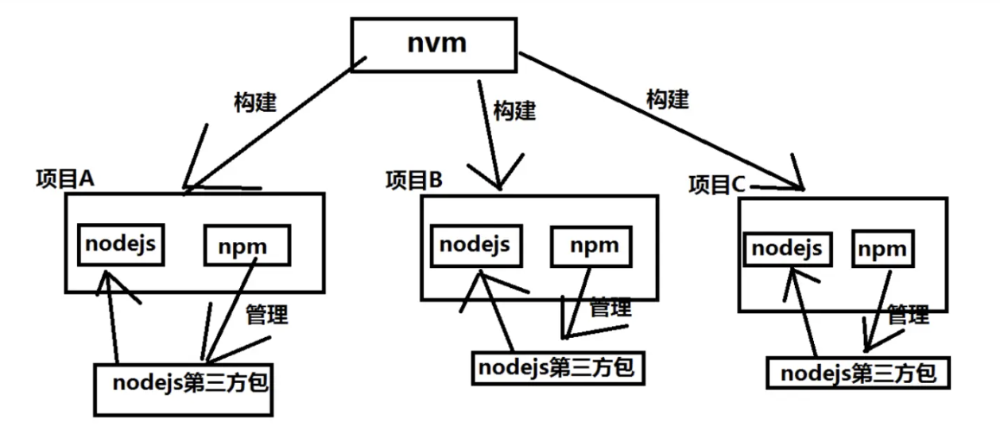

.. notes-dev documentation master file, created by
    sphinx-quickstart on Wed Jun  7 16:41:42 2023.
    You can adapt this file completely to your liking, but it should at least
    contain the root `toctree` directive.
.. notes:
Node
=====================================

nvm、node.js、npm区别与联系
~~~~~~~~~~~~~~~~~~~~~~~~~~~~~~

安装使用
~~~~~~~~~~~~~~~~~~~~~~~~~~~~~~

    nvm ls
    nvm install v14
    nvm use v14
    node -v
    npm -v
    npm install -g cnpm --registry=https://registry.npm.taobao.org
    cnpm install vue -g
    cnpm install vue-cli -g
    cnpm install webpack -g
    vue init webpack admin-front
    npm run dev

.. only::  subproject and html

   Indices
   =======
   * :ref:`genindex`