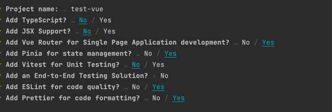
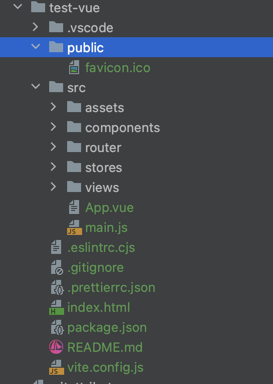

# Vue.js

## 工程结构
```bash
vue init webpack admin-front
npm install
npm run dev

##或者
npm create vue@latest
cd xx
npm install
npm run dev/build
```


- index.html
- package.json
- config
- node_modules
- public
- static
- src
  - assets
  - api
  - components
  - store
  - views
  - routers
  - App.vue
  - main.js

启动流程
```text
index.html->main.js->App.vue->router/index.js(路由线路)
```

主要编写vue文件：  
- template：建立网页界面
- script：数据逻辑
- style：样式，与template结合使用；


