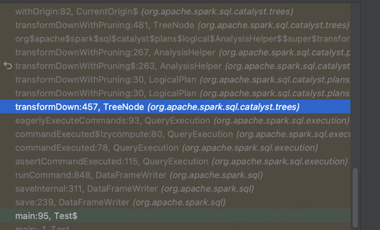

# Iceberg

## 模块
- Nessie-类git版本管理
- Spark
- snowflake
- orc
- parquet
- pig
- open-api
- mr
- kafka-connect
- hive-runtime
- hive-metastore
- gcp/gcp-bundle
- flink
- delta-lake
- dell
- data
- core(提供基本的表操作类-方法-接口)
  - Table
    - AllDataFilesTable.java
    - AllDeleteFilesTable.java
    - AllEntriesTable.java
    - AllFilesTable
    - AllManifestsTable
  - Task
  - Schema
  - DataFile
  - ManifestFile
  - Snapshot
  - AppendFiles
  - OverwriteFiles
  - DeleteFiles
  - MERGE
  - TableOperations
  - FileIO
  - PartitionSpec
  - Transform
  - MetricsConfig
  - TableScan
  - AssignTask
  - PendingUpdate
  - WriterCommitMessage
- api
- common
- aliyun
- aws
- azure
- arrow
- guava

## metadata

- metadata.json：记录所有snap-metadata.json
- snap.avro：记录每个副本的manifest-list
- avro-manifest:每个副本每个表关联的文件以及文件的元数据

## 写入流程

val df = ... // Your DataFrame with data to be written
df.write
  .format("iceberg")
  .option("path", "/path/to/iceberg/table")
  .option("write.mode", "append")
  .partitionBy("column1", "column2") // 分区列
  .save()
DataFrameWriter->save->lookupV2Provider->lookupDataSource->ServiceLoader.load(classOf[DataSourceRegister], loader)->TableProvider table, catalog, ident
org.apache.iceberg.spark.source.SparkWrite->org.apache.iceberg.hadoop.HadoopTableOperations->org.apache.iceberg.SnapshotProducer->org.apache.iceberg.metrics.LoggingMetricsReporter
->org.apache.iceberg.spark.source.SparkWrite->AppendData->AppendDataExec.writeWithV2(batchWrite).commit(messages)
Iceberg API

获取表Schema->获取Spark Session->写文件->写元数据->提交事务->清理

获取表Schema:
主要是通过Catalog、Table、TableMetadata、TableProperties、TableType等获取表的元数据

获取Spark Session:
主要是通过SparkSession、SparkContext、SQLContext等获取spark的session

写文件：
主要实现在BaseBatchWrite-SparkWriter.createWriterFactory->commitOperation
WriterFactory.createWriter->PartitionedDataWriter  
SparkParquetWriter

写元数据

## update：MOR VS COW
merge on read
copy on write

## delete
- position delete
  - ~~equal delete~~

## create table

spark.sql("create table test_iceberg(dt int,data string) using iceberg partitioned by(dt)")

sql-explain-plan:

== Parsed Logical Plan ==
'CreateTableStatement [local, g66na, test_iceberg], [StructField(dt,LongType,true), StructField(data,StringType,true)], [dt], iceberg, false, false

== Analyzed Logical Plan ==
CreateV2Table org.apache.iceberg.spark.SparkCatalog@683fe7b5, g66na.test_iceberg, [StructField(dt,LongType,true), StructField(data,StringType,true)], [dt], [provider=iceberg], false

== Optimized Logical Plan ==
CommandResult CreateTable org.apache.iceberg.spark.SparkCatalog@683fe7b5, g66na.test_iceberg, [StructField(dt,LongType,true), StructField(data,StringType,true)], [dt], [provider=iceberg, owner=game-netease], false
+- CreateV2Table org.apache.iceberg.spark.SparkCatalog@683fe7b5, g66na.test_iceberg, [StructField(dt,LongType,true), StructField(data,StringType,true)], [dt], [provider=iceberg], false

== Physical Plan ==
CommandResult <empty>
+- CreateTable org.apache.iceberg.spark.SparkCatalog@683fe7b5, g66na.test_iceberg, [StructField(dt,LongType,true), StructField(data,StringType,true)], [dt], [provider=iceberg, owner=game-netease], false

SparkCatalog.createTable()->HadooptableBuilder.create()->HadoopTableOperations.commit(null,metadata)

## append-data

df.write.format("iceberg").mode("append").save("local.g66na.test_iceberg")

== Parsed Logical Plan ==
Project [_1#3L AS dt#8L, _2#4 AS data#9]
+- SerializeFromObject [knownnotnull(assertnotnull(input[0, scala.Tuple2, true]))._1 AS _1#3L, staticinvoke(class org.apache.spark.unsafe.types.UTF8String, StringType, fromString, knownnotnull(assertnotnull(input[0, scala.Tuple2, true]))._2, true, false, true) AS _2#4]
   +- ExternalRDD [obj#2]

== Analyzed Logical Plan ==
dt: bigint, data: string
Project [_1#3L AS dt#8L, _2#4 AS data#9]
+- SerializeFromObject [knownnotnull(assertnotnull(input[0, scala.Tuple2, true]))._1 AS _1#3L, staticinvoke(class org.apache.spark.unsafe.types.UTF8String, StringType, fromString, knownnotnull(assertnotnull(input[0, scala.Tuple2, true]))._2, true, false, true) AS _2#4]
   +- ExternalRDD [obj#2]

== Optimized Logical Plan ==
Project [_1#3L AS dt#8L, _2#4 AS data#9]
+- SerializeFromObject [knownnotnull(assertnotnull(input[0, scala.Tuple2, true]))._1 AS _1#3L, staticinvoke(class org.apache.spark.unsafe.types.UTF8String, StringType, fromString, knownnotnull(assertnotnull(input[0, scala.Tuple2, true]))._2, true, false, true) AS _2#4]
   +- ExternalRDD [obj#2]

== Physical Plan ==
*(1) Project [_1#3L AS dt#8L, _2#4 AS data#9]
+- *(1) SerializeFromObject [knownnotnull(assertnotnull(input[0, scala.Tuple2, true]))._1 AS _1#3L, staticinvoke(class org.apache.spark.unsafe.types.UTF8String, StringType, fromString, knownnotnull(assertnotnull(input[0, scala.Tuple2, true]))._2, true, false, true) AS _2#4]
   +- Scan[obj#2]

