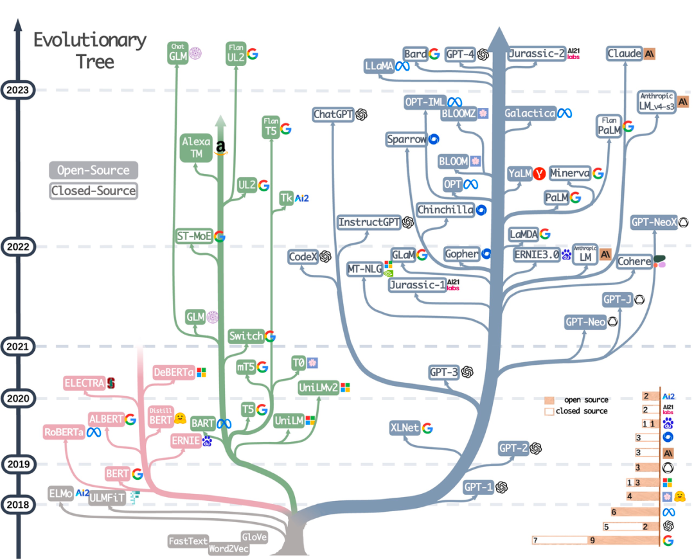
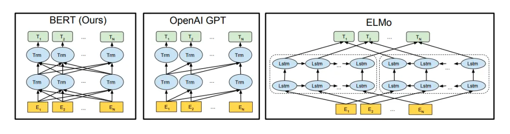
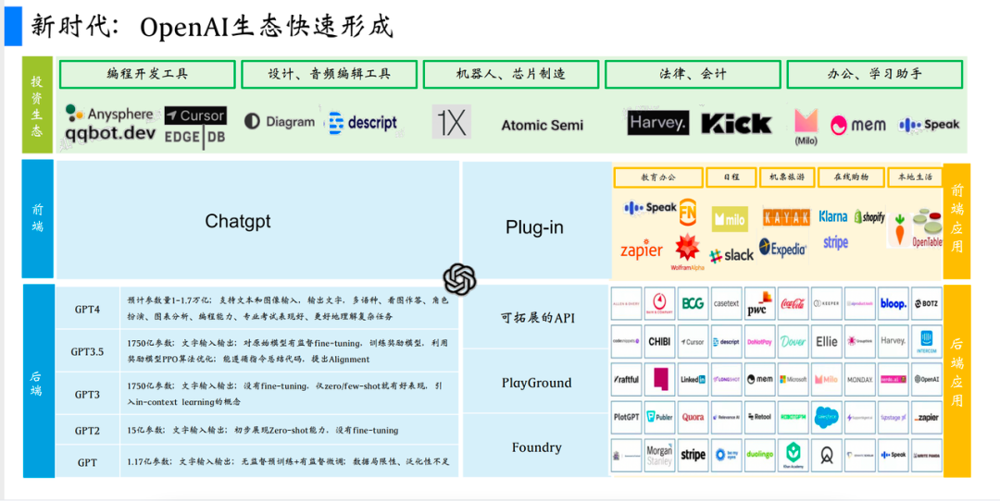
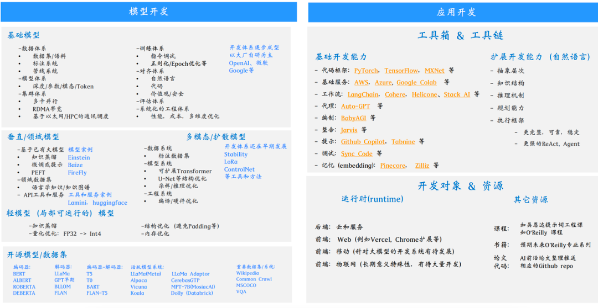
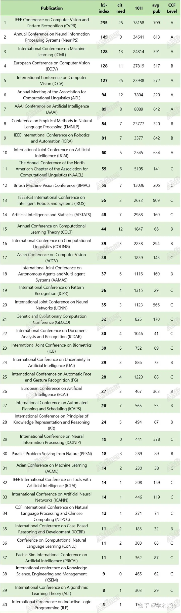

# AI

## 概念
* 预训练模型-hugging face-LLM
* 微调fine-tunning:提供模型在本地数据集进一步训练的能力，达到提高在某个特定领域的表现能力，Freeze方法、P-Tuning方法和Lora方法
* 推理 inference
* pytorch开发工具，提供transformer等库进行模型搭建
* deep speed并行训练
* langchain 大模型与外部计算/数据源结合，类似jdbc
* prompt提示工程


## NLP
- 语言模型演进
  - SLM（统计语言模型）-N-gram：SMT/GMM+HMM
  - NLM（神经网络语言模型）-RNN-LSTM/GRU
  - PLM(预训练语言模型):BERT、GPT-自编码器、Transformer
  - LLM（大模型）-预训练+微调
  - PLLM(多模态大模型)

## CV
## 语音识别
## 自动驾驶
## 模型分类
- LLM
- 文生图
- 文生视频
- 图生视频
- 问答对话
- 机器翻译
- 语音模型
- 增强学习


### 大模型LLM(开源大型语言模型)
 [生命周期](https://developer.qcloudimg.com/http-save/yehe-5990800/6853d7f31bbe33a0f0145e6e13446977.png)

 「1、项目目标」：首先，明确项目目标。决定LLM是作为一个通用工具还是专注于特定任务（如命名实体识别）。明确的目标有助于节省时间和资源。

「2、模型选择」：在从头开始训练模型和修改现有模型之间做出选择。在许多情况下，适应性调整现有模型是高效的，但在某些情况下，可能需要通过新模型进行微调。

「3、模型性能与调优」：准备模型后，评估其性能。如果性能不佳，尝试进行提示工程（prompt engineering）或进一步微调。确保模型输出与人类偏好保持一致。

「4、评估与迭代」：定期使用指标和基准进行评估。在提示工程、微调和评估之间进行迭代，直到达到期望的结果。

「5、模型部署」：当模型表现符合预期时，进行部署。在这个阶段，优化计算效率和用户体验。

#### LLM概览
> 社区资料： [Hugging-Face](https://g.126.fm/01WwwzE)
>
> 词向量-Cbow/Skip-Gram
> 

- ELMo-双向LSTM
- GPT-Transformer(Pre-training + Fine-tuning)
- BERT-Mask Language Model（MLM）/Next Sentence Prediction（NSP）
  <!-- @IGNORE PREVIOUS: link -->
- Llama2
```bash
#colab执行
%cd /content
!apt-get -y install -qq aria2

!git clone -b v1.8 https://github.com/camenduru/text-generation-webui
%cd /content/text-generation-webui
!pip install -r requirements.txt

!aria2c --console-log-level=error -c -x 16 -s 16 -k 1M https://huggingface.co/4bit/Llama-2-13b-chat-hf/resolve/main/model-00001-of-00003.safetensors -d /content/text-generation-webui/models/Llama-2-13b-chat-hf -o model-00001-of-00003.safetensors
!aria2c --console-log-level=error -c -x 16 -s 16 -k 1M https://huggingface.co/4bit/Llama-2-13b-chat-hf/resolve/main/model-00002-of-00003.safetensors -d /content/text-generation-webui/models/Llama-2-13b-chat-hf -o model-00002-of-00003.safetensors
!aria2c --console-log-level=error -c -x 16 -s 16 -k 1M https://huggingface.co/4bit/Llama-2-13b-chat-hf/resolve/main/model-00003-of-00003.safetensors -d /content/text-generation-webui/models/Llama-2-13b-chat-hf -o model-00003-of-00003.safetensors
!aria2c --console-log-level=error -c -x 16 -s 16 -k 1M https://huggingface.co/4bit/Llama-2-13b-chat-hf/raw/main/model.safetensors.index.json -d /content/text-generation-webui/models/Llama-2-13b-chat-hf -o model.safetensors.index.json
!aria2c --console-log-level=error -c -x 16 -s 16 -k 1M https://huggingface.co/4bit/Llama-2-13b-chat-hf/raw/main/special_tokens_map.json -d /content/text-generation-webui/models/Llama-2-13b-chat-hf -o special_tokens_map.json
!aria2c --console-log-level=error -c -x 16 -s 16 -k 1M https://huggingface.co/4bit/Llama-2-13b-chat-hf/resolve/main/tokenizer.model -d /content/text-generation-webui/models/Llama-2-13b-chat-hf -o tokenizer.model
!aria2c --console-log-level=error -c -x 16 -s 16 -k 1M https://huggingface.co/4bit/Llama-2-13b-chat-hf/raw/main/tokenizer_config.json -d /content/text-generation-webui/models/Llama-2-13b-chat-hf -o tokenizer_config.json
!aria2c --console-log-level=error -c -x 16 -s 16 -k 1M https://huggingface.co/4bit/Llama-2-13b-chat-hf/raw/main/config.json -d /content/text-generation-webui/models/Llama-2-13b-chat-hf -o config.json
!aria2c --console-log-level=error -c -x 16 -s 16 -k 1M https://huggingface.co/4bit/Llama-2-13b-chat-hf/raw/main/generation_config.json -d /content/text-generation-webui/models/Llama-2-13b-chat-hf -o generation_config.json

%cd /content/text-generation-webui
!python server.py --share --chat --load-in-8bit --model /content/text-generation-webui/models/Llama-2-13b-chat-hf
```
- ChatGLM
- vicuna
- 其他 ：
  - UniLM、
  - XLNet、
  - BART、
  - RoBERTa、
  - ERNIE、
  - ALBERT、
  - Electra
  - T5
  - MT-DNN
  - PaLM2
#### 微调
- 上下文学习、零样本、单样本和少样本推理
- 有监督微调(SFT)
- 微调方法：
  - 指令微调
  - 全微调（FFT
  - 参数高效微调（PEFT
- 其他
  - 迁移学习
  - 任务特定微调
  - 灾难性遗忘
  - 多任务学习
  - 顺序微调
- 检索增强RAG
### 服务架构

vue/react/angular+python
flask(blueprint+babel)+Dockerfile+Docker-compose.yml


### Stable-Diffusion
生成式模型，文本转图像
### 开源模型
- 百度-文心一言
- 阿里-通义千问
- 腾讯—混元助手
- 华为—盘古
- 科大讯飞—讯飞星火
- 网易—玉言
- 360—360智脑
- 京东—言犀
- 悟道大模型
### Benchmarks
- SuperGLUE（NLP）
- ImageNet(CV)

## 应用
- Ai办公
- AI图像
- AICode
- AI问答


## 免费云计算
- colab
- Kaggle
- Paperspace
- SageMaker

## 会议

