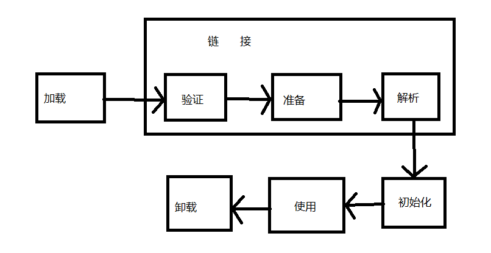
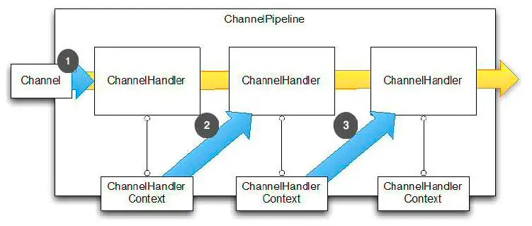
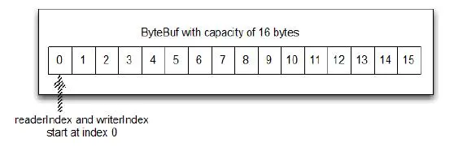

# Java

## JVM原理
- 类加载（class文件）：双亲委派，自下而上委托，自上而下加载
  - 加载方式：本地磁盘-网络下载-jar/war-数据库-动态编译源文件-代理
  - 类加载器种类
    - 启动类(C++加载)
      - jre/lib/rt.jar(sun.boot.class.path目录)
    - 扩展类（ClassLoader的子类：sun.misc.Launcher$ExtClassLoader ）
      - \lib\ext,-Djava.ext.dirs指定
    - 应用类（工程目录下classpath下的文件下.class以及jar包：sun.misc.Launcher$AppClassLoader）
      - java.class.path指定
    - 自定义（非系统类）
      - 重写ClassLoader：loadClass、findClass、loadClassData
- 内存模型（hotspot）运行时数据区：
    大概分为:年轻代-老年代-永久带，堆内存属于年轻-老年，永久带是堆外内存,堆外内存用于保存类型信息、字段、方法、常量等,1.7/1.8以后,永久带移到了元空间
    年轻代（1/3）：对象，分为Eden_8/10-Survivor1_1/10-Survivor2_1/10
    老年代（2/3）：Tenured
  - 堆(年轻代eden区回收minorgc-老年代majorgc-fullgc整个堆内存空间)
  - 栈（虚拟机栈，本地方法栈）
  - 程序计数器
  - 方法区-元空间Non-heap（无永久代，类型信息、字段、方法、常量直接保存在元空间，元空间用的是直接内存，字符串常量池和静态常量还是保持在堆中。
- 垃圾回收(方法区-堆内存-线程私有)
    - 垃圾回收器：Serial、Parallel Scavenge、ParNew、CMS、G1
    - 内存回收策略gc
      - minorgc
      - fullgc
      - majorgc


- class文件结构
- JVM性能参数调优
- 问题诊断工具
    - jps
    - jstack
    - jmap -F -histo pid
    - jhat
    - jstat
- 常见问题诊断
  CPU、Memory、Thread、Classes、GC
- Profile分析
  - Uber jvm-profiler
  - VisualVM
  - arthas
  - async-profiler
## 多进程高并发编程
- 并发理论
cpu-缓存-内存-IO
 原子性（多线程分时复用）、一致性（指令编排）、可见性（缓存）
 解决方案：synchronized/Lock、volatile保证有序性、Happens-Before 规则
- 线程启动方式
    - Thread
    - Runnable
    - Executors.newCachedThread
- 同步实现：
重量级synchronized、ReetrantLock、Lock（AQS）
轻量级cas-aotmic、
无同步方案: 栈封闭，Thread Local，可重入代码
- Synchronized
- volatile
- final
- ThreadLocal
- JUC
    - Aotmic
    - locks-tools
    - collections
        - ConcurrentHashMap
        - CopyOnWriteArrayList
    - exector


## 网络编程
* Stream/Socket
* BIO/NIO/AIO
* Netty
  * Channel
  
  * ByteBuf
  
  * Codec
* akka
* rpc


## 基础框架

- Collections
    - List
        - Vector-Stack
        - ArrayList
        - LinkedList
    - Set
        - HashSet-LinkedHashSet
        - TreeSet
    - Queue
    - Map
        - HashMap-LinkedHashMap
        - TreeMap

- 关键字
    - static
    - abstract
    - interface
    - public/private/protected
    - Optional
    - transient

- 注解 @Override

- 反射 Ref

- 范型 <T>
    - ？ && T

## Java8
- Lambda表达式
- 引用
- 接口默认方法
- Stream
- Optional
- 函数式接口
- Nashorn, JavaScript 引擎
- 新的日期时间 API
- Base64
## SPI：java.util.ServiceLoader类服务加载
1.创建接口文件
2.resources文件夹下创建META-INF/services文件夹
3.在services文件夹中创建文件，用接口命名
4.创建接口实现类

## Java11/17/21


## 异常类-Throwable
- Error
  - OutOfMemoryError
  - StackOverflowError
- Exception
  - InterruptedException
  - RuntimeException
    - NullPointerException
    - IndexOutOfBoundsException
    - ArithmeticException
  - IOException
  - SQLException
## 基准测试Benchmark
- 基准测试工具：JMH
- 常用注解
```java
@Fork(1)
@State(Scope.Benchmark)
@Warmup(iterations = 3)
@Measurement(iterations = 5)
@Timeout(time = 20, timeUnit = TimeUnit.MINUTES)
@BenchmarkMode(Mode.SingleShotTime)
@Benchmark
@Threads(1)
```


